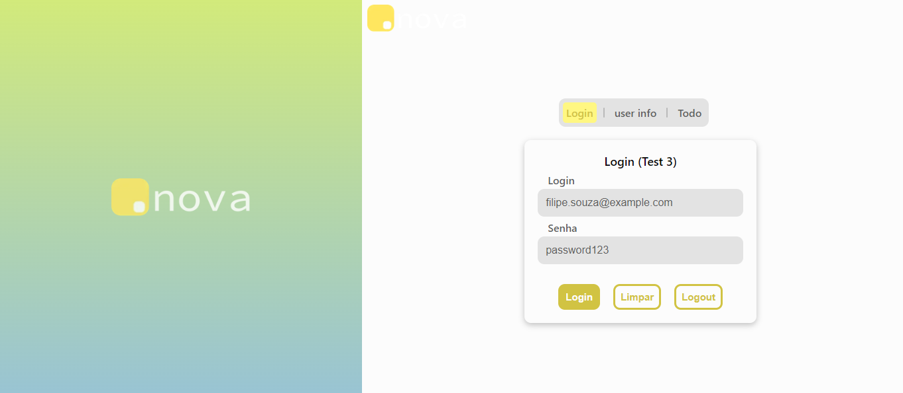
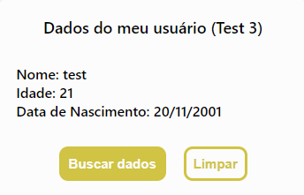
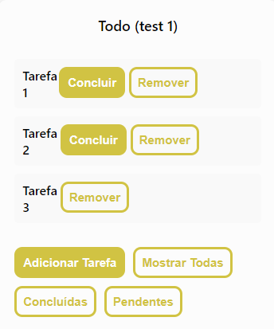

# DotNova

- [x] Questão 1
- [x] Questão 2
- [x] Questão 3
- [ ] Questão 4
- [x] Questão 5


### Test 1 e 3

<div>
  
  
  
</div>

## Front web - React TypeScript

- https://dotnova-blond.vercel.app/
- Integrado aos serviços do google: Directions API, Maps JavaScript API

```
npx create-react-app front --template typescript
npm i styled-components axios
```
