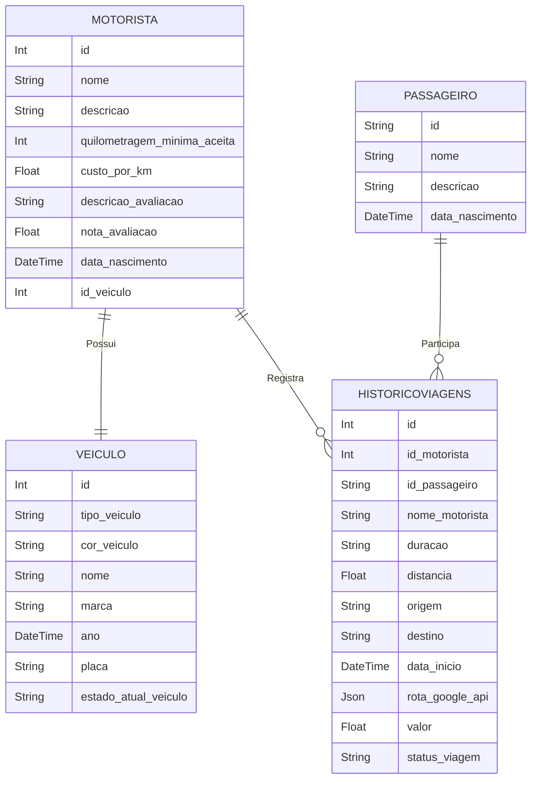

# shopper


### ⚠️  **ATENÇÃO: Serviços Google desativados no projeto devido ao custo.**    


<div>
  
  
  
  
</div>

## Serviços necessários do Google

<div>
  <a href="https://console.cloud.google.com/apis/library/maps-backend.googleapis.com?hl=pt-BR&project=places-api-443513&pli=1&inv=1&invt=AbjE4Q" target="_blank">
    
  <a/>
  <a href="https://console.cloud.google.com/apis/library/routes.googleapis.com?hl=pt-BR&project=places-api-443513&login=true&pli=1" target="_blank">
    
  <a/>
  <a href="https://console.cloud.google.com/apis/library/directions-backend.googleapis.com?hl=pt-BR&project=places-api-443513" target="_blank">
    
  <a/>
</div>

## API - NestJS(node)

- https://shopper-0tsi.onrender.com/api

- [x] Integrado aos serviços do google: Directions API, Routes API
- [x] Prisma como ORM (gerenciador de banco)
- [x] Testes unitários
- [x] Exceptions personalizados
- [x] Documentação Swagger

| Metodo | Rota                           | Descricao                              |
| ------ | ------------------------------ | -------------------------------------- |
| POST   | user/create-driver             | cadastrar motorista no banco           |
| POST   | user/create-passenger          | cadastrar passageiro no banco          |
| POST   | user/create-vehicle            | cadastrar veículo no banco             |
| GET    | user/driver                    | listar motoristas                      |
| GET    | user/passenger                 | listar passageiros                     |
| GET    | user/vehicle                   | listar veículos                        |
| POST   | ride/estimate                  | calcula o trajeto e mostra o motorista |
| PATCH  | ride/confirm                   | salva a viagem no banco                |
| PATCH  | {driver_id}/ride/{customer_id} | busca historico de viagens             |

```
#CRIAÇÃO DA API
- npm i -g @nestjs/cli
- nest new api
- cd api
- npm i --save-dev jest ts-jest @nestjs/testing @types/jest prisma
- npm i @nestjs/common class-validator class-transformer http-status-codes @nestjs/swagger swagger-ui-express @prisma/client @googlemaps/google-maps-services-js dotenv cors
- npx prisma init

#SETTINGS
- npx prisma migrate dev --name init
- npx prisma studio
- npm run test
- npm run test -- <nome-do-teste>
- npm run test -- --coverage
```

## Front web - React TypeScript

- https://shopper-ashy-three.vercel.app/
- Integrado aos serviços do google: Directions API, Maps JavaScript API

```
npx create-react-app front --template typescript
npm i styled-components axios
```

## Banco de dados - postgresSQL



- banco postgres SQL
